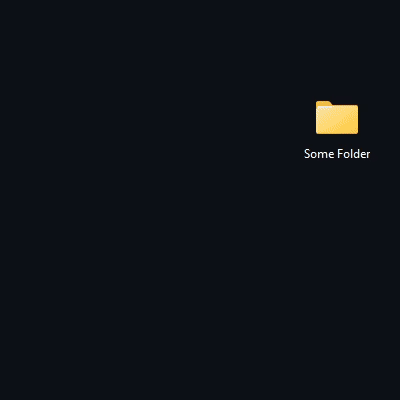

# 🎧 Remixer

[](https://github.com/Umphi/Remixer/actions/workflows/windows-build.yml)

**Remixer** is an application that extends keyboard volume key functionality with **per-application volume control**. It also supports custom control devices (e.g., rotary encoders).

> 💡 **Inspired by** [deej](https://github.com/omriharel/deej) (check  this out, maybe that is what you are looking for)

---

## 🖼️ Preview




---

## ⚙️ Features

- 🎧 Per-application volume control
- 🎹 Integration with keyboard media keys
- 🛠 Supports external control hardware
- 🎨 Custom themes and layouts (`themes.json`, theme creator application coming later)
- 🗂 Configurable via `settings.json`

---

## 🚀 Getting Started

### 🐍 Prerequisites

Install [Python 3](https://www.python.org/downloads/) on your system if not already available.  
To verify:
```bash
python --version
```

---

### 📦 Installation

#### Option 1: Download prebuilt binary (recommended for users)
You can download the ready-to-run version of **Remixer** from the Relea...  
Actually, this option will be available ASAP 😅

---

#### Option 2: Run from source

##### 1. Clone the repository
```bash
git clone https://github.com/Umphi/remixer
cd remixer
```

Or download manually:  
[Download as ZIP](https://github.com/Umphi/Remixer/archive/refs/heads/master.zip) and extract it.

##### 2. Install dependencies
```bash
pip install -r requirements.txt
```

##### 3. Configure
Edit the `settings.json` file to customize your configuration.

##### 4. Run the application
```bash
python main.py
```

---

## 📁 Project Structure

```
remixer/
├── main.py               # Main script
├── settings.json         # Configuration file
├── themes.json           # Themes file
├── requirements.txt      # Python dependencies
├── core/
│   ├── menu.py           # Menu construction
│   ├── remixer_theme.py  # Theme processing
│   ├── renderer.py       # Application drawing
│   ├── icon_manager.py   # Loading and providing icons
│   └── settings.py       # Common application settings control
├── modules/
│   ├── serial_port.py    # Operating with custom controllers
│   └── scroller.py       # Smooth in-system scrolling (currently supports only custom controllers)
├── icons/
│   └── internal/         # Internal icons for menu 
│       └── ... 
├── assets/               # Data for documentation
│       └── ... 
└── ...
```

---

## 🛠 Contributing

Pull requests are welcome but please open an issue first to discuss what you'd like to change or add.

---

## 📄 License

This project is licensed under the **MIT License** — see the [LICENSE](./LICENSE) file for details.

---

## 🌐 Links

- [deej by omriharel](https://github.com/omriharel/deej) — Inspiration
- [Python Downloads](https://www.python.org/downloads/)

---

Made by [Umphi](https://github.com/Umphi) 🖐
